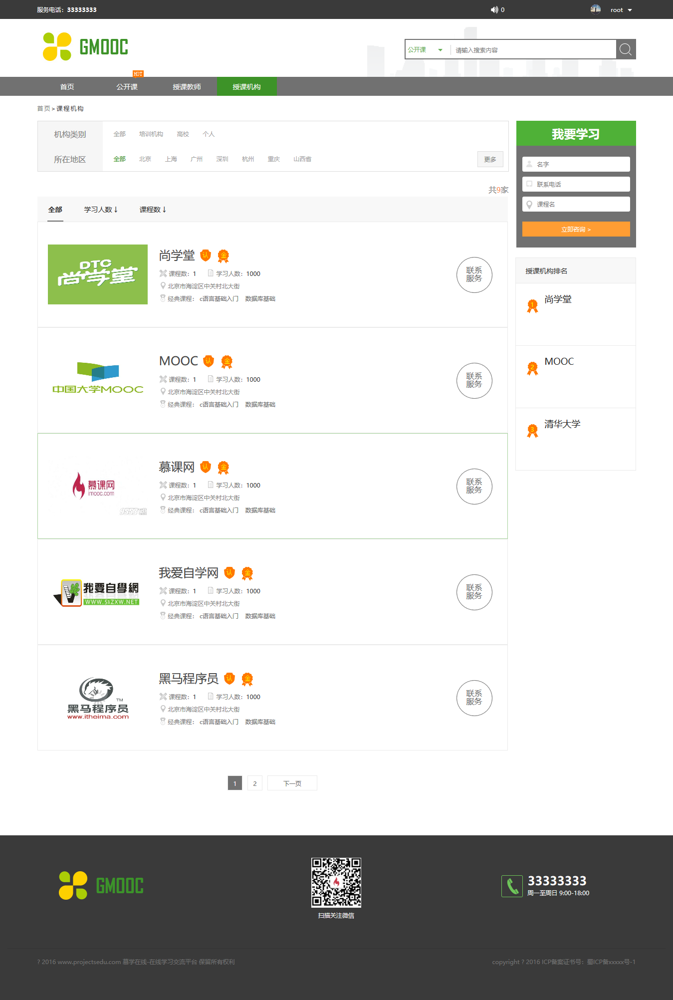
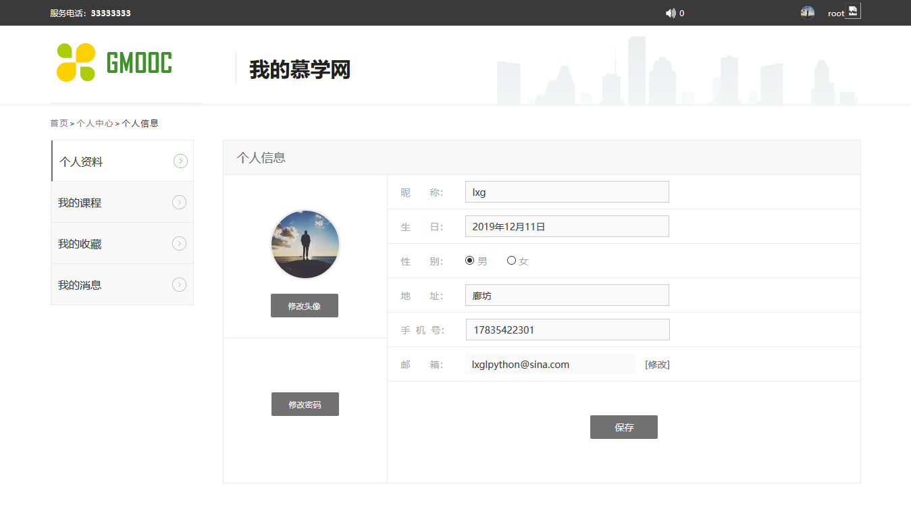

## 慕课网的设计与实现（学习网站），网上bobby老师写的项目环境较老，且有缺省的部分，我已经完善。
## 注意，项目中的笔记为个人编写过程中遇到的一些问题，请下载markdown或者typro方便阅读。
## 环境：python3+django1.11+xadmin+mysql

### 因为功能较多，截取部分功能展示
### 首页

### 因为只有用户登录了，才会为其提供更全面的服务，这是一个邮箱协议的注册界面，目前支持新浪邮箱

### 公开课

### 授课教师

### 授课机构

### 个人中心

